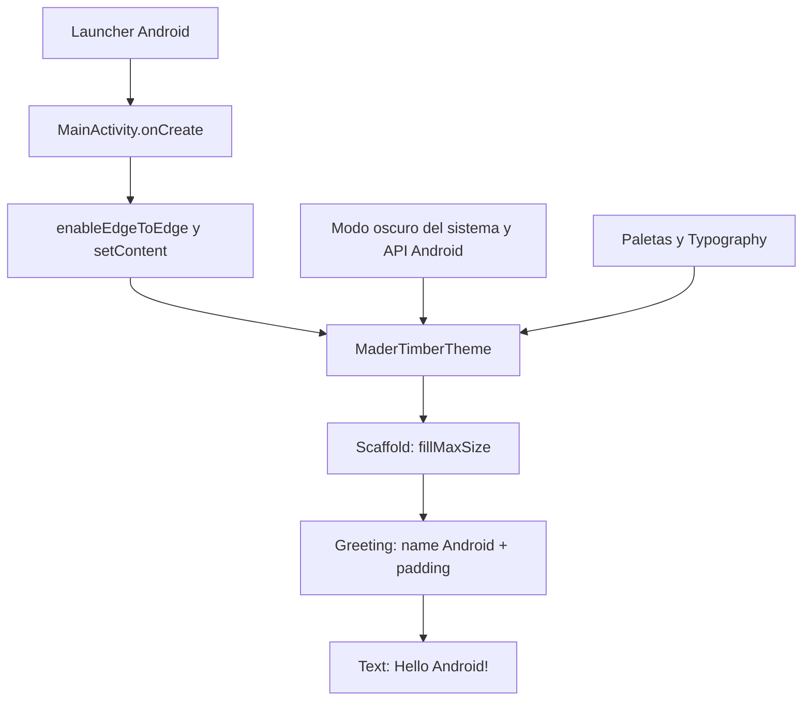

# Arquitectura actual

Revisión: 2026-10-08, código de aplicación en `3dcf635`. **Confirmado por el árbol y los archivos leídos**, no por ejecución en dispositivo.

## Estructura completa por responsabilidades

```text
MaderaTimber/                      # raíz Git, proyecto Gradle MaderTimber
├── AGENTS.md                      # instrucciones permanentes para Codex
├── README.md                      # instalación, uso y traslado entre equipos
├── PLAN_IMPLEMENTACION.md          # secuencia común acordada
├── APRENDIZAJE.md / PROGRESO.md     # tutoría aplicada y progreso
├── MVP_Panel_Indicadores_Impacto_CENAMAD/ # especificación recuperada y enlace al plan
├── docs/                          # arquitectura, decisiones, estado, pendientes, contexto
├── .gitignore / .gitattributes     # exclusiones y finales de línea portables
├── .idea/.gitignore               # exclusiones del IDE; sin configuración compartida adicional
├── settings.gradle.kts            # repositorios, Foojay, inclusión de :app
├── build.gradle.kts               # aliases de plugins, apply false
├── gradle.properties              # heap, UTF-8, Configuration Cache, estilo Kotlin
├── gradlew / gradlew.bat           # ejecución Gradle POSIX/Windows
├── gradle/
│   ├── libs.versions.toml          # catálogo de dependencias/plugins
│   ├── gradle-daemon-jvm.properties # JDK 25 y URLs por SO/arquitectura
│   └── wrapper/                   # properties de distribución y gradle-wrapper.jar
└── app/
    ├── .gitignore                 # excluye /build del módulo
    ├── build.gradle.kts           # aplicación Android, SDK, Compose, dependencias
    └── src/
        ├── main/
        │   ├── AndroidManifest.xml
        │   ├── java/com/duoc/madertimber/
        │   │   ├── MainActivity.kt # actividad, Greeting y GreetingPreview
        │   │   └── ui/theme/       # Theme.kt, Color.kt, Type.kt
        │   ├── keepRules/rules.keep # plantilla de reglas R8 comentadas
        │   └── res/
        │       ├── drawable/      # vectores foreground/background del launcher
        │       ├── mipmap-anydpi-v26/ # iconos adaptativos normal/redondo
        │       ├── mipmap-{mdpi,hdpi,xhdpi,xxhdpi,xxxhdpi}/ # iconos WebP
        │       ├── values/        # strings.xml, colors.xml, themes.xml
        │       └── xml/           # backup_rules.xml, data_extraction_rules.xml
        ├── test/java/com/duoc/madertimber/ExampleUnitTest.kt
        └── androidTest/java/com/duoc/madertimber/ExampleInstrumentedTest.kt
```

`.git/` es metadato local. Directorios de build/caché y `local.properties` se generan por equipo y no son componentes del producto. No hay otros módulos ni proyectos web/servidor en el árbol revisado.

## Componentes y relaciones

| Componente | Responsabilidad y relación |
| --- | --- |
| `settings.gradle.kts` | Define Google/Maven Central/Plugin Portal según su ámbito, impide repositorios en módulos, incluye solo `:app` y configura Foojay. |
| Build raíz y catálogo | Centralizan aliases y versiones. El módulo aplica Android Application y Kotlin Compose. No se aplica un plugin Kotlin Android separado. |
| Build `app` | Configura identidad, SDK, versión 1.0/código 1, Java source/target 11, Compose y runner AndroidJUnitRunner. Optimización release desactivada. Versiones en README/catálogo. |
| Manifiesto | Declara la aplicación y `MainActivity` exportada como launcher; `adjustResize`, soporte RTL y backup habilitado. No declara permisos ni servicios. |
| `MainActivity` | En `onCreate`, activa edge-to-edge y monta contenido Compose: tema → Scaffold a tamaño completo → Greeting con padding del Scaffold. |
| `Greeting` | Recibe `name` y `Modifier`; dibuja `Text("Hello $name!")`. La actividad pasa la constante `Android`. |
| `GreetingPreview` | Vista previa estática en el IDE con el mismo tema y saludo; no es una prueba. |
| `MaderTimberTheme` | Elige colores dinámicos en Android 12+ si están habilitados; de lo contrario paleta clara/oscura según el sistema. Aplica tipografía Material 3. |
| `Color.kt` / `Type.kt` | Paletas estáticas y `bodyLarge` (16 sp, línea 24 sp). No representan una identidad visual Cenamad aprobada. |
| Recursos XML | Etiqueta MaderTimber, tema de ventana sin ActionBar, colores de plantilla e iconos Android. El tema Compose se configura por separado. |
| Reglas de backup/R8 | Plantillas sin reglas de negocio personalizadas. Revisarlas cuando aparezcan datos persistentes o configuración release. |

## Flujo de UI y datos



No hay entrada de usuario, estado de negocio, llamadas de red ni almacenamiento. El único dato explícito del saludo es un String constante; el tema lee configuración/contexto Android. No hay un flujo entre repositorios, casos de uso o backend que documentar.

## Patrones existentes y límites

UI declarativa Compose, funciones composables reutilizables con `Modifier`, tema centralizado y catálogo Gradle. `ComponentActivity` aporta ciclo de vida, pero no hay ViewModel ni MVVM implementado. Tampoco hay Clean Architecture, repositorio de datos, DI, navegación o estrategia offline.

La configuración sugiere una plantilla inicial Android/Compose (**inferencia** por saludo, recursos y pruebas de ejemplo); no consta la plantilla ni versión del IDE de origen. Separar capas o añadir módulos es una **propuesta futura**, sujeta a requisitos y una decisión registrada.

## Arquitectura objetivo confirmada

La asignatura exige MVVM, según instrucción del usuario recuperada del chat local. Se incorporará Model/Repository con datos locales, View Compose y DashboardViewModel con estado observable y eventos. Está pendiente de implementación; seguir el [plan común](../PLAN_IMPLEMENTACION.md) y la [especificación recuperada](../MVP_Panel_Indicadores_Impacto_CENAMAD/README.md). No confundir arquitectura objetivo con los componentes actuales.
